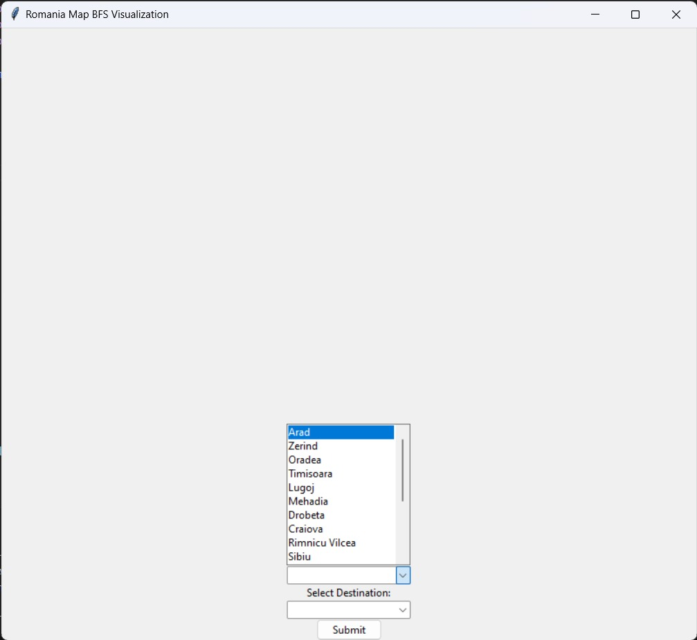
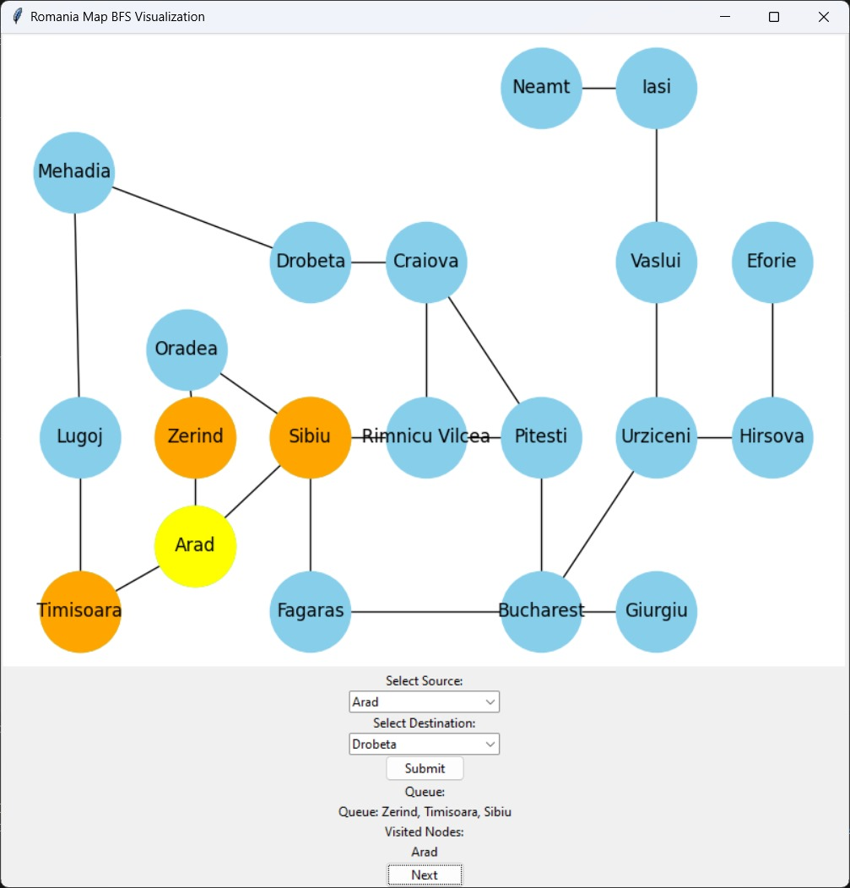
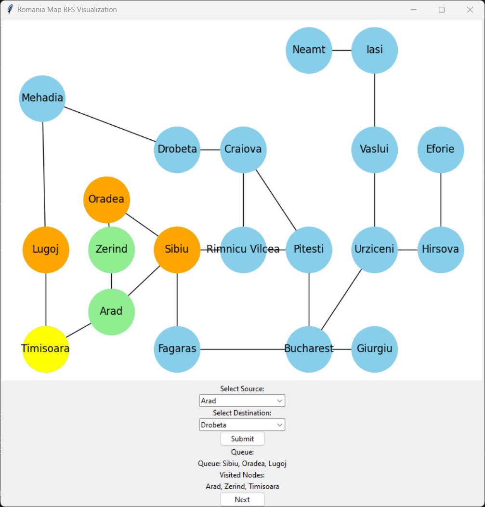
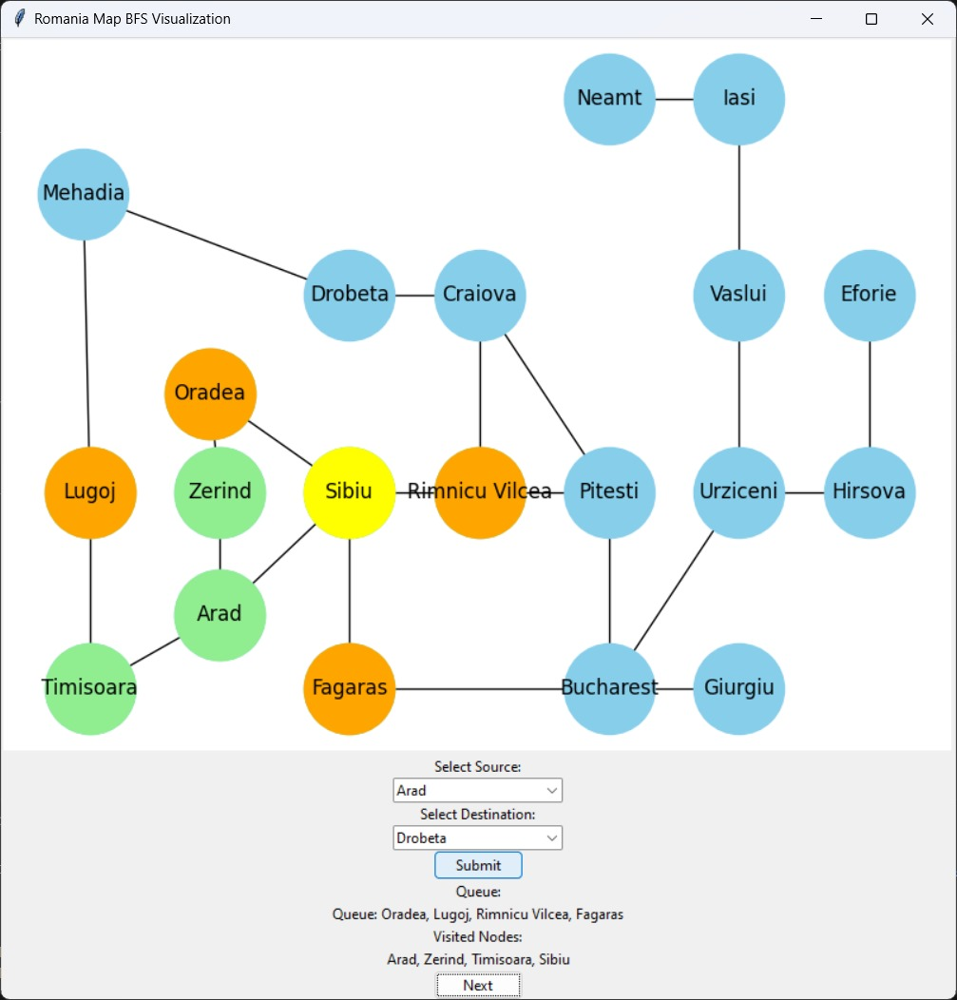
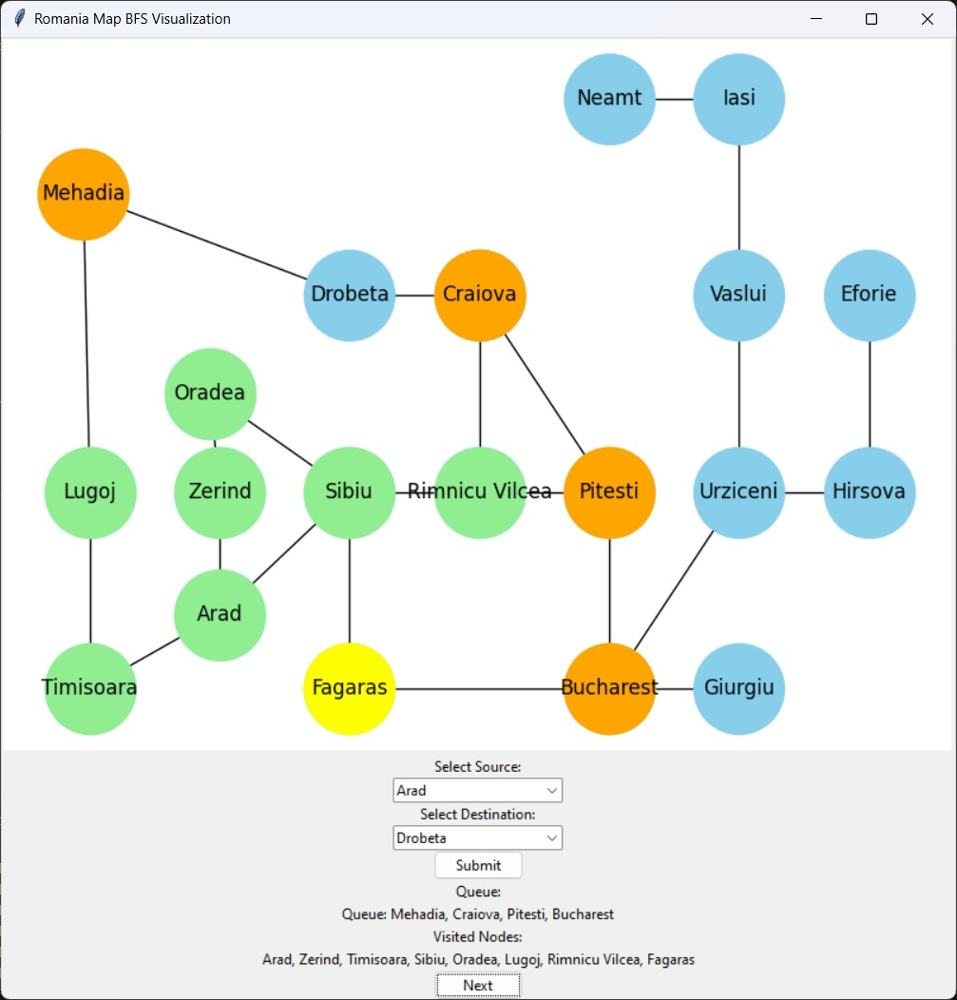
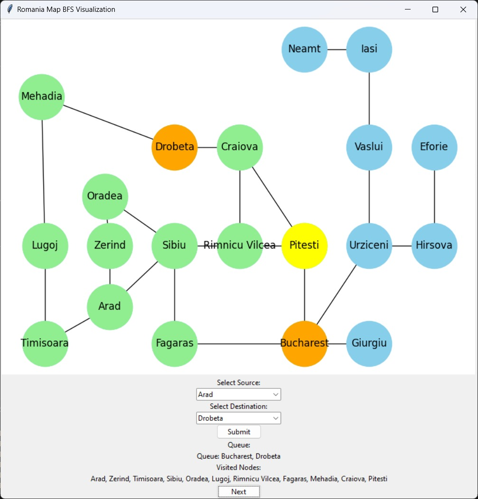

# Romania Map BFS Visualization

This project implements a graphical user interface (GUI) to visualize the Breadth-First Search (BFS) algorithm traversing the map of Romania. The GUI allows users to select a source and destination city, initiating the BFS algorithm's execution, and displays the visualization of each step of the traversal process.

## Setup

1. **Clone the Repository:**
   ```bash
   https://github.com/Smitkhobragade/AI.git
   ```

2. **Install Dependencies:**
   Ensure you have Python 3.x installed. Install required packages using pip:
   ```bash
   pip install networkx matplotlib
   ```

3. **Run the Application:**
   Navigate to the project directory and run the Python script:
   ```bash
   cd project
   python main.py
   ```

## Usage

1. **Select Source and Destination:**
   - Upon running the application, a GUI window will open.
   - Select a source city from the drop-down menu labeled "Select Source."
   - Select a destination city from the drop-down menu labeled "Select Destination."

2. **Execute BFS Algorithm:**
   - After selecting source and destination, click the "Submit" button.
   - The BFS algorithm will execute, and the visualization of the traversal process will be displayed.

3. **Interact with Visualization:**
   - The visualization displays the map of Romania with cities represented as nodes.
   - Green nodes represent visited nodes, while orange nodes represent nodes in the queue.
   - Yellow node indicates the current node being processed.
   - Red edges represent the path from the source to the current node.
   - Click the "Next" button to proceed step-by-step through the BFS algorithm.

4. **View Results:**
   - Upon reaching the destination, a message box will indicate the successful traversal.
   - If the destination is unreachable, a message box will notify accordingly.

5. **Close the Application:**
   - Close the GUI window to exit the application.

## Outputs 

- Choosing Source


- Choosing Destination


- Now, after clicking 'Next' button we traversal step by step along with current state of Queue and Visited.






- Lastly, after we reach at destination node. Path is highlighted and popup regarding success in displayed.

